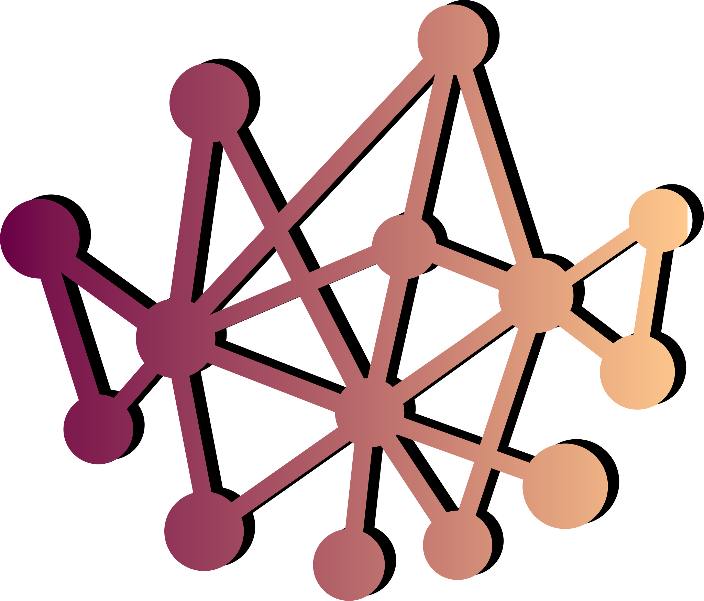

<div align="center">

<h1>Lattice</h1>
<p><i>Structure Meaning. Foreground Mechanisms.</i></p>
</div>
<p align="center">
<a href="https://github.com/ekjaisal/Lattice/releases"></a>
<a href="https://github.com/ekjaisal/Lattice/blob/main/LICENSE"></a>
<a href="https://doi.org/10.5281/zenodo.20271310"></a>
<a href="https://github.com/ekjaisal/Lattice/releases"></a>
<a href="https://github.com/ekjaisal/Lattice/stargazers"></a>
</p>

Lattice is a free and open-source Computer-Assisted Qualitative Data Analysis Software (CAQDAS). Designed to be native, lightweight, fast, and scalable, it is envisaged from the ground up to be intuitive for setting up and managing projects.

The CAQDAS landscape occupies a niche, predominantly catering to social science researchers, but unfortunately, with a limited range of options due to the following structural conditions:

* Researchers who need QDA software are not among the most enthusiastic about programming.

* Developers who build software often do not engage with or commit to qualitative research.

* Qualitative coding and data analysis inherently demand significant human involvement in interpretation and therefore resist automation. The limited scope for experimenting with cutting-edge technologies makes it a less exciting space for software developers.

* Compared to quantitative tools used for statistical analysis, the target user base is smaller, making it harder to reach a critical mass sufficient to sustain a wider range of serious projects.

Lattice aims to contribute constructively to addressing the persistent gap under the aforementioned conditions, as a tool developed with philosophical commitments to being primarily offline, extremely lightweight, and highly scalable, with minimal resource demands. To realise this, its design intentionally avoids heavy frameworks or dependency trees and remains as native as possible without compromising on speed, flexibility, or features.

A Lattice analysis project is a single file. The user interface is, and will progressively continue to become, as friendly and intuitive as possible so that a user can get started without excessive cognitive friction. The guiding spirit of Lattice is the idea that technical *underlabouring* in research software design should ensure that cognitive affordances flow towards rigorous data analysis, rather than the struggle to navigate the tool’s complexities.

> [!TIP]
> The foundational technical stack that enables Lattice to realise its ambitions comprises the [Lazarus IDE](https://www.lazarus-ide.org) and [Free Pascal Compiler](https://www.freepascal.org), [SQLite3](https://sqlite.org), [Cairo](https://cairographics.org), and [Pango](https://docs.gtk.org/Pango). Having said that, a user need not concern themselves with the inner workings of any of these components, as all interactions are abstracted and managed directly through the graphical user interface. The application can be set up directly using the single, fully self-contained installer file.

> [!NOTE]
> Lattice currently works only on Windows. While making it available cross-platform is feasible, it may only be realised in the distant future. The Windows build specifically targets the widely used 64-bit architecture (`amd64`/`x86-64`).

## Features

- **Documents:** The primary analytical data unit in Lattice is called a document. A document can be anything, ranging from a news article, a research paper, an interview transcript, a tweet, a YouTube comment, a poem, a novel, or even a full-length book in several volumes. Documents are retained only as plain text. Image, audio, and video are not supported. Users can import as many documents as the analysis requires, with the limit set only by the hardware on which the application runs. Every effort is made to keep the application-side resource overhead to a bare minimum required to render and engage with the document.
- **Import Data:** Documents can be imported directly as plain-text `TXT` files or extracted from `DOCX`, `ODT`, or `PDF` files. Documents with associated attributes such as age, location, author, etc., can be imported from `XLSX`, `ODS`, `JSON`, or SQLite database files. A dedicated *Import Manager* assists in mapping source columns or keys to corresponding target fields, such as *Document Name*, *Document Content*, *Attribute*, or skipping entirely.
- **Attributes:** Lattice handles attributes as typed rather than flat, to extract maximum analytical utility from them. The five supported attribute types are: *Text*, *Categorical*, *Numeric*, *Date-Time*, and *URL or Path*. A document can have as many attributes as needed, and these may be used for type-sensitive filtering during retrieval, analysis, sorting, or targeted narrowing. The attributes associated with a document are also displayed in the bottom-left panel, along with the content text, for contextual anchoring. For instance, a URL or Path type attribute is clickable. It can open the original webpage in an external browser or a file whose path is correctly included for quick access. Attribute types can be defined in the Import Manager during data import or managed directly in the *Attribute Manager*.
- **Codes:** Creating and organising codes and sub-codes can be done directly from the main window. Lattice supports a hierarchy of six levels for codes and sub-codes. Each code can be assigned a colour, which is then used to highlight segments, coding brackets, and the action anchors when the code is applied to a section of the document. Codes can be modified, reordered, promoted, or demoted from the context menu or through the available shortcut keys. The *Code System* can be exported and imported as a `JSON` file for reuse, and the *Codebook* can be exported as `XLSX`, `ODS`, and `CSV`.
- **Memos:** Apart from codes, five types of memos are supported: (i) *Project Memo* (for project-wide notes), (ii) *Analytical Memo*s (for fleeting thoughts), (iii) *Document Memos* (document-specific), (iv) *Code Memos* (code-specific), and (v) *Segment Memos* (segment-specific). All memos can be centrally managed and exported directly from the *Memo Manager* in `XLSX`, `ODS`, `CSV`, `JSON`, and `XML` formats. Document, Code, or Segment Memos visually indicate their existence by underlining the document name in the list, the code name in the tree, or the segment in the document, respectively.
- **Retrieval:** The coded data can be retrieved and exported for manual engagement and reporting from the *Retrieval Manager*. The set of documents, codes, or attributes to filter the retrieval can be specified in the manager. Exports are supported in `XLSX`, `ODS`, `CSV`, `JSON`, `XML`, and as `PDF` or `HTML` coding reports. Export can be customised to include or exclude fields, and to sort segments in the report by specific fields.
- **Analysis:** Five types of analyses are built into the *Analysis Workspace*: (i) *Code Frequency*, (ii) *Code Co-occurrence*, (iii) *Attribute-Code Crosstab*, (iv) *Coding Coverage*, and (v) *Word Cloud* (filtered by a customisable stopwords list). The document, code, and attribute scope for each analysis can be adjusted in the workspace to narrow down and precisely target the segments of analytical interest. The visualisations generated in the analysis workspace can be exported as `SVG`, `PDF`, `PNG`, and `JPEG`, and the analysis data tables can be exported as `XLSX`, `ODS`, `CSV`, `JSON`, and `XML`.
- **Edit Document:** While the document rendering panel is primarily for reading, it includes an editing mode that can be enabled by clicking the button next to the document name above the reading panel. Mistakes in the document can be corrected, and text can be added or removed while in edit mode, and the existing codings and memos will harmonise with the changes.
- **Filter, Sort, and Search:** The document list can be filtered to identify items of interest using patterns in *Document Title*, *Document Content (FTS5)*, or by *Attribute Values*. It can be sorted by *Import Time*, *Coding Count*, *Segment Memo Count*, or *Attribute Values*, and the sort preferences can be saved across sessions. Patterns within an open document can be searched for directly using the search bar above the document reading panel. Both the document list and the code tree can be searched for matches using the search box above each panel. The codes can be sorted analytically by *Code Name*, *Coding Count*, or *Creation Count*, and the sort order can be made permanent or reset as required.
- **Language Support:** Lattice is intended to be useful to researchers across various linguistic contexts, and hence a genuine effort has been made to support both Right-to-Left and Left-to-Right scripts and emojis in the document content. The application can render documents and produce coding reports for most languages as long as the font required to render the script or character is installed on the device running the application. The precision of highlight display over characters might vary slightly for highly complex scripts. However, despite the visual differences, the segment gets correctly coded and included in the exports, in most cases.

## Usage

1. Download the installer from the [Releases](https://github.com/ekjaisal/Lattice/releases/latest) page or from [https://lattice.jaisal.in](https://lattice.jaisal.in).

2. Install and launch the application.
> [!NOTE]
> Windows SmartScreen may flag the installer as an unrecognised application. Provided the installer is sourced from the locations specified in step 1, bypass the prompt by clicking **More info** → **Run anyway**. For added assurance, [verify](#verification) the `SHA256SUMS`.

3. Use the start-up dialog to create a new project or open an existing one.

4. Import documents into the project, create codes, and get started with coding.

5. Refer to the [user guide](UserGuide.txt) or navigate to **Help** → **User Guide** in the application menu for more details on usage.

## Verification

A PGP-signed `SHA256SUMS` file is included with the release artefacts for integrity verification.

| Fingerprint                                         | Key Server                                   |
| --------------------------------------------------- | -------------------------------------------- |
| `C4A8 E4F9 1650 7DD9 49D4 5DF8 B4ED 8851 B020 2101` | [keys.openpgp.org](https://keys.openpgp.org) |

## Building from Source

Lattice is built and shipped with a ready-to-set-up installer. However, if required, it can be rebuilt exactly (or with modifications) by following the Windows build process specified below:

### Build Prerequisites

1. [Lazarus](https://www.lazarus-ide.org) IDE v4.6 or later

2. [Free Pascal Compiler](https://www.freepascal.org) v3.2.2 (included with the Lazarus IDE)

3. [FPSpreadsheet](https://wiki.freepascal.org/FPSpreadsheet) installed in Lazarus IDE via [Online Package Manager](https://wiki.freepascal.org/Online_Package_Manager)

4. [MSYS2](https://www.msys2.org) (for upstream C library dependencies)

### Build Instructions

1. **Install MSYS2**
   
   Download and install MSYS2 to the default directory (`C:\msys64`). 

2. **Sync the Package Database**
   
   Launch the MSYS2 MINGW64 terminal and run the following update command:

   ```bash
   pacman -Syu
   ```
> [!TIP]
> If prompted, close the terminal, reopen it, and run the command again to update the core system fully.

3. **Install the Required Libraries**
   
   Run the following command in the MSYS2 terminal to install [Pango](https://docs.gtk.org/Pango), [Cairo](https://cairographics.org), [SQLite3](https://sqlite.org), and their associated dependencies into the [MinGW-w64](https://www.mingw-w64.org) environment, along with [ntldd](https://packages.msys2.org/packages/mingw-w64-x86_64-ntldd) to track their dependencies:

   ```bash
   pacman -S mingw-w64-x86_64-pango mingw-w64-x86_64-cairo mingw-w64-x86_64-sqlite3 mingw-w64-x86_64-ntldd
   ```

4. **Fetch Dependencies into the Project**
   
   Clone the Lattice repository, navigate to the `scripts/` directory, and execute the `setup-deps.bat` script to copy all the required `.dll` files (along with their dependencies) from MSYS2 into the `bin/` directory.

5. **Compile the Application**
   
   Open `Lattice.lpi` in the Lazarus IDE and execute the build by navigating to **Run** → **Build** (or by pressing `Shift` + `F9`). The executable will be compiled to the `bin/` directory.

> [!NOTE]
> For most users, the ready-to-set-up installer from the [Releases](https://github.com/ekjaisal/Lattice/releases/latest) page should suffice.

## Acknowledgements

Lattice is built using the [Lazarus IDE](https://www.lazarus-ide.org) and the [Free Pascal Compiler](https://www.freepascal.org). The project distributes and links against several third-party open-source libraries. These libraries, and other third-party components and resources, are governed entirely by their respective licenses. The Lattice project claims no copyright over them. Please see the [NOTICE](NOTICE) file for details.

The project has benefited significantly from Google [Gemini 3.1 Pro](https://deepmind.google/models/model-cards/gemini-3-1-pro)’s assistance for collaborative ideation, code generation, and refactoring.

## License

Copyright © 2026 [Jaisal E. K.](https://jaisal.in)

Lattice is free software: you can redistribute it and/or modify it under the terms of the [GNU Affero General Public License](https://www.gnu.org/licenses/agpl-3.0.en.html) as published by the [Free Software Foundation](https://www.fsf.org), either version 3 of the License, or (at your option) any later version.

Lattice is distributed in the hope that it will be useful, but WITHOUT ANY WARRANTY; without even the implied warranty of MERCHANTABILITY or FITNESS FOR A PARTICULAR PURPOSE. See the [GNU Affero General Public License](LICENSE) for more details.
